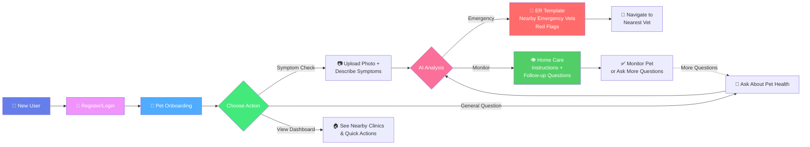
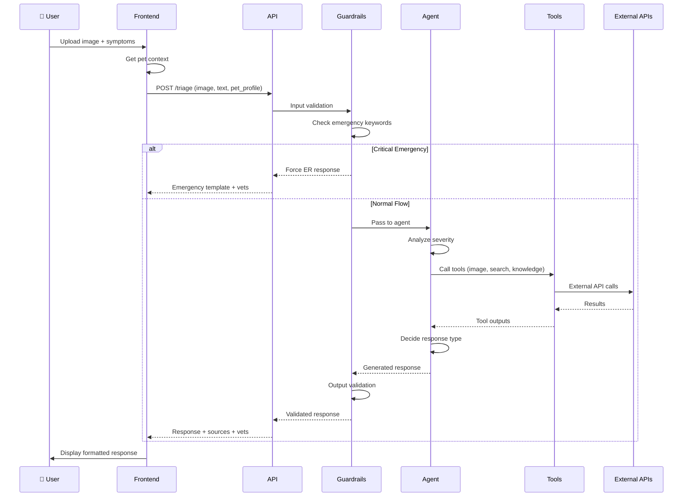
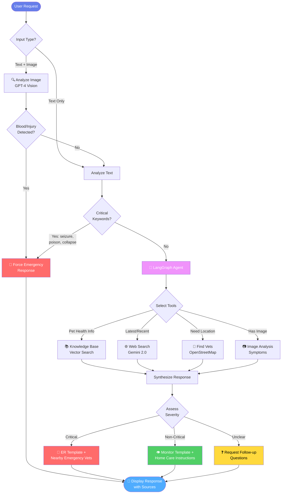
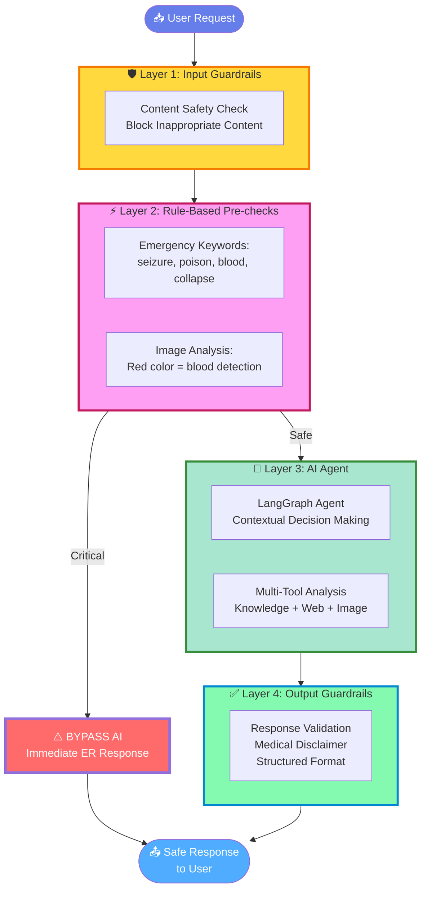
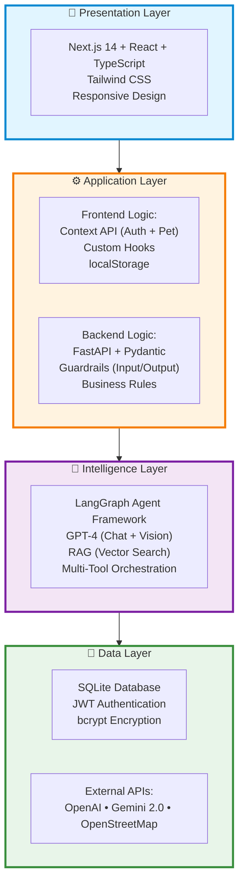

# 🐾 Fuzzy Friend: AI-Powered Pet Triage System

**Fuzzy Friend** is an intelligent pet health assistant designed to help pet owners assess symptoms, determine urgency, and find nearby veterinary care. It combines a user-friendly Next.js frontend with a robust Python backend powered by **LangGraph Agents** and **RAG (Retrieval-Augmented Generation)**.

---

## ✨ Key Features

| Feature | Description |
|---------|-------------|
| 🩺 **AI Triage Assessment** | Structured symptom analysis with 4 urgency levels (ER, Today, Soon, Monitor) |
| 📷 **Visual Analysis** | Upload photos for GPT-4 Vision image analysis |
| 📚 **RAG Knowledge Base** | 18,000+ veterinary records via vector database |
| 🌐 **Real-time Web Search** | Gemini 2.0 + Google Search for latest treatments |
| 📍 **Nearby Vet Finder** | Auto-locate open clinics with distance, hours, and ER status |
| 🛡️ **Multi-Layer Safety** | 4-layer safety system with guardrails and emergency detection |
| 💬 **Personalized Chat** | Pet context-aware responses for breed-specific advice |
| 🔐 **Secure Authentication** | JWT-based auth with SQLite persistence |

---

## 🏗️ System Architecture

### High-Level Overview

```mermaid
graph LR
    User([👤 Pet Owner<br/><small>Web Browser</small>])
    
    subgraph Frontend["🖥️ Frontend<br/>Next.js + React"]
        Pages["📱 Pages<br/><small>Auth • Onboarding<br/>Home • Chat</small>"]
        Chatbot["💬 Chatbot<br/><small>Symptom Checker<br/>General Chat</small>"]
        State["🔄 State<br/><small>Auth • Pet<br/>localStorage</small>"]
    end
    
    subgraph Backend["⚙️ Backend<br/>FastAPI"]
        API["🔌 API<br/><small>/auth /triage<br/>/chat /vets</small>"]
        Guards["🛡️ Guardrails<br/><small>Input/Output<br/>Safety</small>"]
        Logic["⚡ Logic<br/><small>Emergency<br/>Detection</small>"]
    end
    
    subgraph Data["💾 Data<br/>SQLite"]
        DB[("🗄️ DB<br/><small>users • profiles<br/>sessions</small>")]
        PetCtx["🐾 Context<br/><small>species • breed<br/>age • history</small>"]
    end
    
    subgraph AI["🤖 AI Layer<br/>LangGraph + GPT-4"]
        Agent["🧠 Agent<br/><small>Decision<br/>Engine</small>"]
        Tools1["📚 RAG<br/><small>Vector<br/>Search</small>"]
        Tools2["🌐 Web<br/><small>Gemini<br/>Search</small>"]
        Tools3["📷 Vision<br/><small>Image<br/>Analysis</small>"]
        Tools4["🏥 Vets<br/><small>Location</small>"]
        Tools5["🚨 ER<br/><small>Template</small>"]
    end
    
    subgraph External["🌍 External<br/>Services"]
        OpenAI["🤖 OpenAI<br/><small>GPT-4<br/>Vision</small>"]
        Google["🔍 Google<br/><small>Gemini 2.0<br/>Search</small>"]
        OSM["📍 OSM<br/><small>Maps</small>"]
    end
    
    User -->|Interact| Pages
    Pages --> Chatbot
    Pages --> State
    Chatbot -->|POST| API
    State -.->|Token<br/>Pet Data| API
    
    API --> Guards
    Guards --> Logic
    Logic <-->|CRUD<br/>Sessions| DB
    DB --> PetCtx
    
    Logic -->|Request +<br/>Context| Agent
    PetCtx -.->|Personalize| Agent
    
    Agent --> Tools1 & Tools2 & Tools3 & Tools4 & Tools5
    
    Tools1 & Tools3 --> OpenAI
    Tools2 --> Google
    Tools4 --> OSM
    
    style User fill:#667eea,color:#fff,stroke:#5a67d8,stroke-width:3px
    style Frontend fill:#e1f5ff,stroke:#0288d1,stroke-width:3px
    style Backend fill:#fff3e0,stroke:#f57c00,stroke-width:3px
    style Data fill:#e8f5e9,stroke:#388e3c,stroke-width:3px
    style AI fill:#f3e5f5,stroke:#7b1fa2,stroke-width:3px
    style External fill:#fce4ec,stroke:#c2185b,stroke-width:3px
    
    style Pages fill:#4fc3f7,color:#fff
    style Chatbot fill:#29b6f6,color:#fff
    style State fill:#03a9f4,color:#fff
    
    style API fill:#ffb74d,color:#000
    style Guards fill:#ffa726,color:#000
    style Logic fill:#ff9800,color:#fff
    
    style DB fill:#66bb6a,color:#fff
    style PetCtx fill:#4caf50,color:#fff
    
    style Agent fill:#ab47bc,color:#fff
    style Tools1 fill:#ce93d8,color:#000
    style Tools2 fill:#ce93d8,color:#000
    style Tools3 fill:#ce93d8,color:#000
    style Tools4 fill:#ce93d8,color:#000
    style Tools5 fill:#ce93d8,color:#000
    
    style OpenAI fill:#f48fb1,color:#000
    style Google fill:#f48fb1,color:#000
    style OSM fill:#f48fb1,color:#000
```



### User Journey Flow



### Data Flow - Triage Request



### AI Agent Decision Logic



### Multi-Layer Safety System



### Technology Stack



---

## 📁 Project Structure

```
genai_group_project/
├── .env                    # Environment variables (API keys)
├── README.md               # This file
├── ARCHITECTURE.md         # Detailed architecture documentation
├── frontend/               # Next.js 14 frontend application
│   ├── app/                # App Router pages
│   │   ├── auth/           # Login/Register
│   │   ├── chat/           # Chat interface
│   │   ├── onboarding/     # Pet profile setup
│   │   ├── profile/        # User profile
│   │   └── settings/       # App settings
│   ├── components/         # Reusable UI components
│   │   ├── AuthContext.tsx # Authentication state
│   │   ├── PetContext.tsx  # Pet profile state
│   │   └── chatbot/        # Chat modal components
│   └── lib/                # API client utilities
└── pet_triage/             # Python backend
    ├── api.py              # FastAPI entry point
    ├── auth.py             # JWT authentication
    ├── database.py         # SQLite database operations
    ├── main.py             # Triage orchestration
    ├── input_guardrails.py  # Input validation
    ├── output_guardrails.py # Output validation
    ├── core/               # AI Agent module
    │   ├── agent.py        # LangGraph ReAct Agent
    │   ├── tools.py        # Agent tools (7 tools)
    │   ├── rag_chain.py    # RAG knowledge base
    │   └── image_analyzer.py # GPT-4V image analysis
    ├── shared/             # Shared constants and schemas
    │   ├── constants.py    # Single source of truth
    │   ├── prompts.py      # System prompts
    │   ├── schemas.py      # Pydantic response schemas
    │   └── red_flags.py    # Emergency detection rules
    └── tests/              # Unit tests
```

---

## 🚀 Getting Started

### Prerequisites

- **Node.js** 18+ and npm
- **Python** 3.10+
- **API Keys** (set in `.env` file):
  - `OPENAI_API_KEY` - Required (GPT-4)
  - `GOOGLE_API_KEY` - Required (Gemini 2.0 for web search)
  - `PINECONE_API_KEY` - Optional (for RAG vector search)

### Quick Start

#### 1. Clone the Repository

```bash
git clone <repository-url>
cd genai_group_project
```

#### 2. Backend Setup

```bash
cd pet_triage

# Install dependencies
pip install -r requirements.txt

# Create .env file
cat > .env << EOF
OPENAI_API_KEY=sk-your-openai-key
GOOGLE_API_KEY=your-google-api-key
PINECONE_API_KEY=your-pinecone-key  # Optional
EOF

# Initialize database
python -c "from database import init_db; init_db()"

# Start the server
uvicorn api:app --reload --port 8000
```

Backend will be available at: **http://localhost:8000**  
API docs at: **http://localhost:8000/api/docs**

#### 3. Frontend Setup

   ```bash
   cd frontend

# Install dependencies
npm install

# Create .env.local file
cat > .env.local << EOF
NEXT_PUBLIC_API_URL=http://localhost:8000
EOF

# Start development server
   npm run dev
```

Frontend will be available at: **http://localhost:3000**

#### 4. Access the Application

1. Open **http://localhost:3000** in your browser
2. Register a new account or login
3. Complete pet onboarding (mandatory)
4. Start using the Symptom Checker or General Chat!

---

## 🔌 API Endpoints

| Endpoint | Method | Description |
|----------|--------|-------------|
| `/api/health` | GET | Health check |
| `/api/auth/register` | POST | User registration |
| `/api/auth/login` | POST | User login |
| `/api/auth/me` | GET | Get current user |
| `/api/pet-profile` | POST/GET | Save/retrieve pet profile |
| `/api/triage` | POST | Run symptom triage assessment |
| `/api/chat` | POST | General pet health chat |
| `/api/nearby-vets` | POST | Find nearby veterinary clinics |
| `/api/triage-history` | GET | Get triage session history |

### Example Triage Request

```json
{
  "symptoms": "My dog is vomiting and seems lethargic",
  "category": "auto",
  "image_base64": "data:image/jpeg;base64,...",
  "pet_profile": {
    "name": "Bella",
    "species": "dog",
    "breed": "Golden Retriever",
    "age_years": 5,
    "weight": 30
  }
}
```

---

## 🛡️ Safety Features

### Multi-Layer Safety System

1. **Input Guardrails**: Content safety, scope validation, emergency pre-checks
2. **Rule-Based Pre-checks**: Hard-route critical emergencies (seizure, poison, blood)
3. **AI Agent**: Contextual decision-making with tool orchestration
4. **Output Guardrails**: Response validation, medical disclaimers, structured format

### Safety Principles

- ✅ **No Diagnosis**: Only triage guidance, never definitive diagnosis
- ✅ **No Medication Dosing**: Never provides drug dosages
- ✅ **Conservative Escalation**: When uncertain, escalate to higher urgency
- ✅ **Always Disclaimer**: Every response includes medical disclaimer
- ✅ **Emergency Hard-Routing**: Critical conditions bypass LLM for immediate ER response

### Emergency Detection

The system automatically detects and hard-routes these emergencies:

- 🐱 Cat open-mouth breathing
- 💜 Blue/purple gums (cyanosis)
- 🐱 Male cat urinary straining (12+ hours)
- ⚡ Seizure > 5 minutes or 3+ in 24 hours
- 🫁 Bloat symptoms (distended abdomen + unproductive retching)
- 🩸 Heavy uncontrolled bleeding
- 👁️ Eye proptosis (eye popped out)

---

## 🚨 Risk Levels

| Level | Icon | Meaning | Action |
|-------|------|---------|--------|
| **ER** | 🚨 | Emergency | Go to emergency vet NOW |
| **TODAY** | ⚠️ | Urgent | Vet visit today |
| **SOON** | 📅 | Non-urgent | Vet visit within 24-48 hours |
| **MONITOR** | ✅ | Low-risk | Safe to monitor at home |

---

## 🛠️ Agent Tools

The LangGraph agent has access to 7 specialized tools:

| Tool | Type | Description |
|------|------|-------------|
| `vector_search` | RAG | Search 18,000+ pet health records in knowledge base |
| `web_search` | API | Real-time web search via Gemini 2.0 + Google Search |
| `analyze_pet_image` | Vision | Analyze pet photos with GPT-4 Vision |
| `find_nearby_vets` | API | Find nearby vet clinics via OpenStreetMap |
| `get_er_template` | Template | Get pre-built emergency response |
| `get_monitor_template` | Template | Get home care instructions |
| `request_followup` | Generator | Ask clarifying questions |

---

## 🧪 Running Tests

```bash
cd pet_triage
python tests/run_all_tests.py
```

---

## 📊 Tech Stack Summary

| Layer | Technology |
|-------|------------|
| **Frontend** | Next.js 14, React, TypeScript, Tailwind CSS |
| **Backend** | FastAPI, Python 3.10+, Pydantic |
| **Database** | SQLite3 (users, pet_profiles, triage_sessions) |
| **AI/ML** | LangGraph, OpenAI GPT-4, GPT-4 Vision |
| **Web Search** | Gemini 2.0 + Google Search |
| **Auth** | JWT (PyJWT), bcrypt |
| **Maps** | OpenStreetMap Overpass API |
| **Vector DB** | Pinecone (for RAG knowledge base) |

---

## 🎯 Key Features

✅ **Personalized AI**: Pet profile context in every chat/triage  
✅ **Multi-modal Input**: Text + image analysis  
✅ **Intelligent Tool Selection**: Agent chooses knowledge base vs web search  
✅ **Emergency Detection**: Rule-based + AI-based safety checks  
✅ **Source Attribution**: Display tools used (📚 Knowledge Base, 🌐 Web Search)  
✅ **Nearby Clinics**: Distance in miles, 24hr/ER status, working hours  
✅ **Secure Auth**: JWT tokens, protected routes, persistent sessions  
✅ **User-friendly UI**: Suggested prompts, simplified modes, proper formatting

---

## 📄 License

This project is for educational purposes as part of ISBA 2421.

---

## 📚 Additional Documentation

- **[ARCHITECTURE.md](./ARCHITECTURE.md)** - Detailed architecture documentation with all diagrams
- **[pet_triage/README.md](./pet_triage/README.md)** - Backend-specific documentation
- **[frontend/README.md](./frontend/README.md)** - Frontend-specific documentation

---

## 🤝 Contributing

This is a group project for ISBA 2421. For questions or issues, please contact the project team.

---

**Built with ❤️ for pet owners everywhere**
