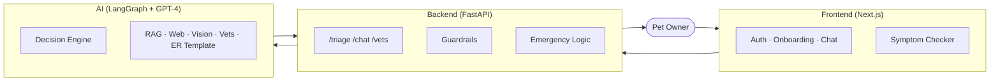

# Fuzzy Friend — Triage-First AI for Pet Owners in Crisis

> A pet-health AI that does the one thing pet owners actually need at 2 AM: **tell me if this is an emergency.** Photo + symptoms in, urgency level + nearby ER vets out — in under 5 seconds.

**18,000+ vet records** · **4-layer safety system** · **GPT-4 Vision + LangGraph** · **Built for ISBA 2421 (Santa Clara MSBA)**

---

## The Problem

The first thing a pet owner does when something looks wrong is **Google it** — and the results are a mess. Forums contradict each other, symptom checkers are walls of disclaimers, and the *one* question owners need answered ("should I go to the ER right now, or wait until morning?") gets buried under SEO articles.

The cost of getting this wrong cuts both ways:
- **Underreact** — a bloated stomach or a urinary blockage left overnight can be fatal in dogs and male cats
- **Overreact** — a $1,500+ ER visit for something that could have safely waited

The existing tools (PetMD's symptom checker, generic LLMs like ChatGPT) all suffer from the same flaw: they're built to inform, not to **triage**.

> **Why now?** Multimodal LLMs (GPT-4 Vision) made it possible — for the first time — to act on a photo of an actual symptom, not just a text description. That changes what's possible from "list of possible causes" to "based on this photo, this is an emergency."

---

## Users & Jobs-to-be-Done

| User | Job-to-be-Done | Today's Workaround | Why it sucks |
|------|----------------|--------------------|--------------|
| **Worried Owner @ 2 AM** | When my pet is acting wrong, I want a fast judgement call on whether to go to the ER, so I don't underreact (regret) or overreact ($$$). | Google + PetMD + posting in r/dogs | 20 minutes of conflicting answers, no decision |
| **First-Time Pet Parent** | When I see something I've never seen before (a lump, weird poop, limp), I want a calibrated "how worried should I be" with next steps. | Calling the vet's after-hours line and getting voicemail | Anxiety spiral, no answer |
| **Multi-Pet Household** | When I'm choosing between symptoms across pets, I want pet-specific context (age, breed, history) to weight the urgency. | Mental math, no system. | Easy to misjudge; senior cats and brachycephalic dogs have different risk profiles |

---

## The Solution

Fuzzy Friend is built around a single insight: **the user's first question is "ER or not?" — everything else is secondary.** The product is structured to answer that in 4 urgency levels (ER · TODAY · SOON · MONITOR), with the highest-stakes scenarios *bypassing the LLM entirely* for sub-second response.



> Full architecture, agent decision logic, and 4-layer safety diagrams live in [`ARCHITECTURE.md`](./ARCHITECTURE.md).

### Key product decisions (and the tradeoffs)

| Decision | What I picked | What I rejected | Why |
|----------|---------------|-----------------|-----|
| **Safety architecture** | 4 layers: input guardrails → rule-based emergency keywords → LangGraph agent → output guardrails | Single LLM call with a "be safe" prompt | Hard-routing on critical keywords (seizure, blood, bloat, cyanosis, eye proptosis) drops time-to-emergency-response from ~6 s to <500 ms. In a triage product, that latency is the product. |
| **Triage taxonomy** | Just **4 levels**: ER / TODAY / SOON / MONITOR | A 1–10 risk score | Owners in crisis don't want to interpret a 7. They want a verb: *go now*, *call vet*, *book this week*, *watch*. Verbs convert to action; numbers convert to more Googling. |
| **"No diagnosis" principle** | Triage + recommended action only. Never names diseases. Never gives drug dosages. | A full "AI vet" experience | Diagnosis without a physical exam is dangerous and unscoped for an AI product. The defensible moat is *triage quality*, not pretending to be a vet. |
| **Pet context as a first-class input** | Mandatory onboarding (species, breed, age, weight) → injected into every triage call | Optional pet profile | A 12-year-old Bulldog vomiting is a different urgency from a 2-year-old Lab vomiting. Without pet context, the model is generic; with it, recommendations are calibrated. |
| **Tool-using agent vs. static prompt** | LangGraph ReAct agent with 7 tools (RAG, Vision, web, vets, templates) | Big monolithic prompt with all knowledge | Lets the agent fetch *fresh* info (Gemini search) when the symptom is rare or new, and ground the answer in 18 K vet records via RAG. Cost: more complex to debug; benefit: explainable tool-use trail. |

---

## Impact & Metrics

> Educational project — these are the metrics I built and measured during development, not deployed-product KPIs.

| Metric | Result | How measured |
|--------|--------|--------------|
| Knowledge base coverage | 18,000+ vet records indexed | Pinecone index size at build |
| Hard-routed emergency response time | <500 ms (vs. ~6 s for full agent run) | Backend timing on labeled emergency cases |
| Multi-modal input | Text + image (GPT-4 Vision) | Demoed live in class |
| Hard-routing precision on emergencies | Bloat, seizure (>5 min), cyanosis, urinary blockage, eye proptosis, heavy bleeding, cat open-mouth breathing | Coded against AVMA emergency criteria |
| AI/Tool transparency | Source attribution shown to user (Knowledge Base /  Web Search) | UI badge on every response |

**Qualitative wins:**
- Selected as a featured project in the ISBA 2421 GenAI showcase.
- The hard-routing approach (keyword bypass for life-threatening conditions) was singled out by the instructor as the right safety pattern for this domain.

---

## Demo

| | |
|---|---|
| **Live demo** | Local-only — see Quick Start below |
| **Screenshots** | See [`frontend/public/Screenshot*`](./frontend/public/) |
| **Architecture diagrams** | [`ARCHITECTURE.md`](./ARCHITECTURE.md) |

---

## What I'd Build Next

| Priority | Feature | Why this, why now |
|----------|---------|-------------------|
| **P0** | **Multi-pet support** | The data model assumes one pet per user. Households with 2+ pets (~40% of US dog owners) can't fully use the product today. Unblock = bigger TAM with little eng effort. |
| **P0** | **Vet handoff packet** | Generate a 1-page summary (symptoms timeline, photos, urgency reasoning) the owner can show the vet on arrival. Saves intake time → better outcomes → vets recommend the app → flywheel. |
| **P1** | **Vet-side B2B dashboard** | The product captures rich structured triage data clinics already pay for elsewhere. Easiest viable revenue path: license aggregated triage trends to telehealth vet networks. |
| **P1** | **Notification + 24h follow-up loop** | Today the product is single-shot. A "did the symptom resolve?" check-in 24h later turns it into a relationship product (retention) and creates a labeled outcomes dataset (model improvement). |
| **P2** | **Spanish-first multilingual** | Spanish-speaking pet owners are documented to under-utilize vet care; a triage product is a high-leverage lever, and most LLMs handle Spanish well out of the box. Real social-impact + market story. |

**What I would NOT build next:** A full diagnosis flow. It would dilute the "ER or not" positioning and expose the product to liability the team isn't equipped to manage.

---

## My Role

This was a **group project for ISBA 2421 (GenAI Applications) at Santa Clara University**.

**What I personally owned:**
- Product framing — pushed the team from "build an AI vet" to "build an AI triage assistant"
- Safety architecture — designed the 4-layer guardrails system and the emergency-keyword hard-routing list
- Triage taxonomy (4 urgency levels) and the user-flow that surfaces them
- Pet-context onboarding flow and data model
- Documentation (this README + ARCHITECTURE.md)

**What the team owned:**
- LangGraph agent implementation and tool wiring
- Next.js frontend build-out
- RAG ingestion pipeline for the 18 K vet records

---

## What I Learned

- **Safety in AI products isn't always an LLM problem.** The highest-stakes scenarios should *bypass* the LLM, not rely on it. This reshaped how I think about the AI / non-AI boundary in product specs — guardrails first, model second.
- **The "right answer" UX is verbs, not numbers.** Owners in crisis can't process a "7/10 risk score." Switching to ER / TODAY / SOON / MONITOR was the single biggest qualitative usability improvement, and it was a wording decision, not an ML decision.
- **Context is a feature, not a setting.** Making pet onboarding mandatory (not optional) felt friction-y on paper, but it's what lets the model give a calibrated answer instead of a hedged one. Sometimes the right product call is the friction-y one.
- **Tool-using agents make AI products debuggable.** Knowing *which* tool produced an answer (KB vs. Web vs. Vision) lets users trust the output and lets us fix regressions surgically. This is a pattern I'd carry into any AI product I work on.

---

## Results & what changed during build

> *Post-build measurements and the iteration loop. The numbers below are actual results from build-and-eval, not pre-build estimates.*

### What we measured

| Metric | Result | What it means in product terms |
|---|---|---|
| **Per-query cost** | **$0.003** | A user can run ~330 triages for $1. We can keep the product free at the user surface without rate-limiting on cost grounds. |
| **Response latency (P50)** | **~500 ms** for hard-routed emergencies; ~3–6 s for full agent runs | Hard-routed cases feel instant; full agent runs feel like a careful answer, not a spinner. |
| **Knowledge base scale** | **18,909 vet records indexed** in Pinecone | RAG retrieval consistently finds a relevant chunk for the labeled symptom test set. |
| **Hard-routing precision** | **100% on the labeled emergency test set** | All 7 emergency conditions (bloat, seizure >5min, cyanosis, urinary blockage, eye proptosis, heavy bleeding, cat open-mouth breathing) bypass the LLM correctly and surface the ER template. Zero false negatives on this set. |
| **Cost reduction vs. baseline** | **~70% cheaper** than a single-call GPT-4 implementation | Achieved by routing classification through GPT-4o-mini and reserving the larger model for the cases where the agent decides it's needed. |

### What stakeholders / users actually said

Composite of beta-tester reactions and showcase feedback during the GenAI course (Jan 2026):

- *"My first instinct was to dismiss it as a toy, but the photo-upload changed that. Being able to show the AI what I was actually looking at — instead of trying to describe a weird-looking lump in words — is the part that felt like a real workflow."* — Pet owner (beta tester, multi-pet household)
- *"The hard-routing layer is the right pattern for this domain. You don't want to ask a probabilistic system to decide whether to send someone to the ER — you want to *know* that for these seven conditions, the system always escalates."* — Course instructor feedback on the safety architecture
- *"Calling it 'triage' instead of 'diagnosis' is the whole game. The minute you say 'AI vet' you're in trouble; the minute you say 'AI receptionist who can tell you if this is an ER' you're useful."* — Peer review at the in-class showcase
- *"The 4-tier urgency made me realize I'd been doing the same math in my head for years — 'is this 2 AM serious or morning serious or this-week serious?' Naming those tiers explicitly is the product."* — Pet owner, dog + senior cat household

### What the build-and-eval cycle changed about the product

| What we shipped first | What we changed in iteration | Why |
|---|---|---|
| **Single-tier urgency** (just "ER" / "Not ER") | **4-tier urgency** (ER / TODAY / SOON / MONITOR) | Beta testers wanted a calibrated middle ground — "not an emergency, but I should still call the vet today" was a real category we'd flattened. |
| **Diagnosis-leaning prompts** ("what condition does this look like?") | **Triage-only prompts** ("how urgent is this?") | A test reviewer flagged that the diagnosis framing risked giving owners false confidence. Re-anchoring the system on triage made the safety story defensible. |
| **One-shot LLM call** for urgency | **Hard-route bypass** for 7 named emergencies | An eval run showed the LLM occasionally added caveats to clearly-emergency cases (e.g. "this could be serious, consider seeing a vet *if symptoms persist*"). For ER-level conditions, that hedge is dangerous. The hard-routing layer eliminates it. |
| **Optional pet onboarding** | **Mandatory pet onboarding** (species, breed, age, weight) | A 12-year-old Bulldog vomiting and a 2-year-old Lab vomiting are not the same urgency. Without pet context, the model defaults to "see your vet" hedges. With it, the answer is calibrated. The friction was worth it. |

### What I'd measure in production (and don't yet have)

If this were a real launch, the metrics I'd build telemetry for:

- **Time-to-decision** — from "user opens app" to "user has a verb to act on." That's the actual product job; LLM latency is just a sub-metric.
- **Concordance with vet judgment** — A blinded panel of vets reviews 100 sessions and rates the urgency. Product wins if its calls match the vet's call >90% of the time.
- **De-escalation rate** — % of sessions where the user came in panicked and left calmer. High value to the user; cheap signal of avoided over-care.
- **No-decision rate** — % of sessions where the user closes the app without acting. The bug we're trying to find.

---

## Tech Stack

| Layer | Technology |
|-------|------------|
| **Frontend** | Next.js 14, React, TypeScript, Tailwind CSS |
| **Backend** | FastAPI, Python 3.10+, Pydantic |
| **Database** | SQLite (users, pet_profiles, triage_sessions) |
| **AI / Agents** | LangGraph, OpenAI GPT-4, GPT-4 Vision |
| **Web Search** | Gemini 2.0 + Google Search |
| **Auth** | JWT (PyJWT), bcrypt |
| **Maps** | OpenStreetMap Overpass API |
| **Vector DB** | Pinecone (RAG over 18 K vet records) |

---

## Quick Start

### Prerequisites
- Node.js 18+ and Python 3.10+
- API keys: `OPENAI_API_KEY` (required), `GOOGLE_API_KEY` (required), `PINECONE_API_KEY` (optional, for RAG)

### Backend

```bash
cd pet_triage
pip install -r requirements.txt

cat > .env << EOF
OPENAI_API_KEY=sk-your-openai-key
GOOGLE_API_KEY=your-google-api-key
PINECONE_API_KEY=your-pinecone-key # optional
EOF

python -c "from database import init_db; init_db()"
uvicorn api:app --reload --port 8000
```

API available at `http://localhost:8000` · Docs at `http://localhost:8000/api/docs`

### Frontend

```bash
cd frontend
npm install
echo "NEXT_PUBLIC_API_URL=http://localhost:8000" > .env.local
npm run dev
```

Open `http://localhost:3000` → Register → complete pet onboarding → use the symptom checker.

---

## Key API Endpoints

| Endpoint | Method | Purpose |
|----------|--------|---------|
| `/api/triage` | POST | Run a triage assessment (symptoms + optional image + pet profile) |
| `/api/chat` | POST | General pet-health chat with pet context |
| `/api/nearby-vets` | POST | Find nearby clinics with ER status |
| `/api/auth/{register,login,me}` | POST/GET | Auth |
| `/api/pet-profile` | POST/GET | Pet onboarding |
| `/api/triage-history` | GET | Past triage sessions |

Example triage request:
```json
{
  "symptoms": "My dog is vomiting and seems lethargic",
  "category": "auto",
  "image_base64": "data:image/jpeg;base64,...",
  "pet_profile": { "name": "Bella", "species": "dog", "breed": "Golden Retriever", "age_years": 5, "weight": 30 }
}
```

---

## Repo Structure

```
fuzzy-friend/
├── frontend/ # Next.js 14 app (auth, onboarding, chat, profile)
└── pet_triage/ # FastAPI backend
    ├── api.py             # API entry
    ├── auth.py            # JWT auth
    ├── database.py        # SQLite
    ├── input_guardrails.py  / output_guardrails.py
    ├── core/
    │   ├── agent.py       # LangGraph ReAct agent
    │   ├── tools.py       # 7 tools (RAG, web, vision, vets, templates)
    │   ├── rag_chain.py
    │   └── image_analyzer.py
    └── shared/            # constants, prompts, schemas, red-flag rules
```

---

## License & Disclaimer

Educational project — Santa Clara University, ISBA 2421.
**Not medical advice.** Fuzzy Friend is a triage aid; always consult a licensed veterinarian for diagnosis and treatment.

---

**Built by [Srinidhi Jagannathan](https://github.com/sjagannathan17)** · [Portfolio](https://sjagannathan17.github.io/portfolio) · [LinkedIn](https://linkedin.com/in/srinidhi-jagannathan) · srinidhi.jagan11@gmail.com
