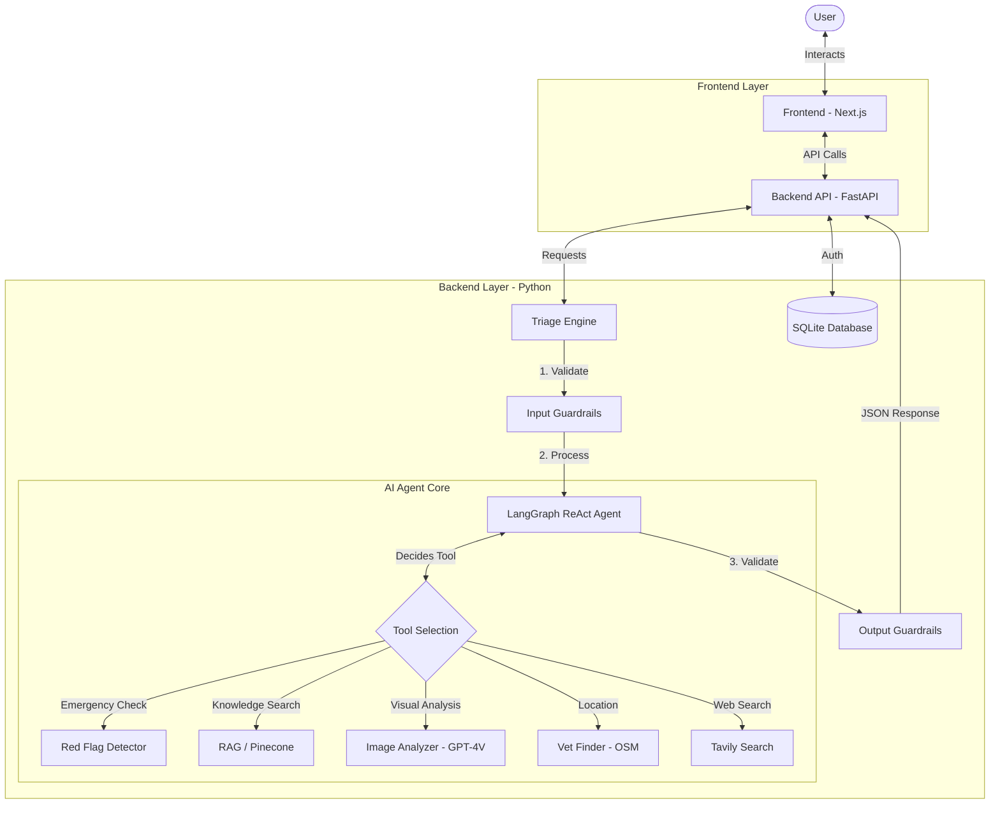

# 🐾 Fuzzy Friend: AI-Powered Pet Triage System

**Fuzzy Friend** is an intelligent pet health assistant designed to help pet owners assess symptoms, determine urgency, and find nearby veterinary care. It combines a user-friendly Next.js frontend with a robust Python backend powered by LangChain/LangGraph Agents and RAG (Retrieval-Augmented Generation).

---

## ✨ Key Features

| Feature | Description |
|---------|-------------|
| 🩺 **AI Triage Assessment** | Structured symptom analysis with 4 urgency levels (ER, Today, Soon, Monitor) |
| 📋 **Symptom Categories** | 9 pre-defined categories for faster, more accurate triage |
| 🧠 **Patient Chart Memory** | AI remembers past sessions to identify recurring issues |
| 💬 **Multi-turn Chat** | Follow-up questions in General Question mode with full context |
| 📷 **Visual Analysis** | Upload photos for GPT-4V image analysis |
| 📚 **RAG Knowledge Base** | 18,000+ veterinary records via Pinecone vector database |
| 📍 **Nearby Vet Finder** | Auto-locate open clinics using OpenStreetMap |
| 🛡️ **Safety Guardrails** | 5-layer input + 6-layer output validation |

---

## 🏗️ System Architecture



---

## 📁 Project Structure

```
genai_group_project/
├── .env                    # Environment variables (API keys)
├── README.md               # This file
├── start.sh                # Quick start script
├── frontend/               # Next.js 14 frontend application
│   ├── app/                # App Router pages
│   │   ├── auth/           # Login/Register
│   │   ├── chat/           # Chat interface
│   │   ├── onboarding/     # Pet profile setup
│   │   ├── profile/        # User profile
│   │   └── settings/       # App settings
│   ├── components/         # Reusable UI components
│   │   └── chatbot/        # Chat modal with category selection
│   └── lib/                # API client utilities
└── pet_triage/             # Python backend
    ├── api.py              # FastAPI entry point
    ├── auth.py             # JWT authentication
    ├── database.py         # SQLite database operations
    ├── main.py             # Triage orchestration
    ├── llm_setup.py        # OpenAI client & model config
    ├── input_guardrails.py # 5-layer input validation
    ├── output_guardrails.py# 6-layer output validation
    ├── core/               # AI Agent module
    │   ├── agent.py        # LangGraph ReAct Agent
    │   ├── tools.py        # Agent tools (7 tools)
    │   ├── rag_chain.py    # RAG knowledge base
    │   └── image_analyzer.py # GPT-4V image analysis
    ├── shared/             # Shared constants and schemas
    │   ├── constants.py    # Single source of truth
    │   ├── prompts.py      # System prompts
    │   ├── schemas.py      # Pydantic response schemas
    │   └── red_flags.py    # Emergency detection rules
    └── tests/              # Unit tests
```

---

## 🚀 Getting Started

### Prerequisites
- Node.js 18+ and npm
- Python 3.10+
- API Keys (set in `.env` file):
  - `OPENAI_API_KEY` - Required
  - `PINECONE_API_KEY` - For RAG
  - `TAVILY_API_KEY` - For web search (optional)

### Quick Start (One Command)

```bash
# Mac/Linux
chmod +x start.sh && ./start.sh

# Or run manually:
# Terminal 1: cd pet_triage && uvicorn api:app --reload --port 8000
# Terminal 2: cd frontend && npm run dev
```

Then open **http://localhost:3000** in your browser.

### Manual Installation

1. **Backend Setup**:
    ```bash
    cd pet_triage
    pip install -r requirements.txt
    uvicorn api:app --host 0.0.0.0 --port 8000
    ```

2. **Frontend Setup**:
    ```bash
    cd frontend
    npm install
    npm run dev
    ```

3. Access the app at `http://localhost:3000`.

---

## 📋 Symptom Categories

Users select a category before describing symptoms for more accurate triage:

| Category | Icon | Examples |
|----------|------|----------|
| Toxic Ingestion & Poisoning | ☠️ | Ate chocolate, toxic plants |
| Stomach Upset | 🤢 | Vomiting, diarrhea |
| Itching & Skin Issues | 🔴 | Rashes, hair loss |
| Injury & Bleeding | 🩹 | Cuts, wounds, trauma |
| Concerning Behaviour Changes | 😰 | Lethargy, aggression |
| Ears, Eyes, and Mouth | 👁️ | Eye discharge, ear infection |
| Breathing Issues | 😮‍💨 | Coughing, wheezing |
| Urinary & Genital | 💧 | Straining to urinate |
| Something Else | ❓ | Other symptoms |

---

## 🚨 Risk Levels

| Level | Icon | Meaning | Action |
|-------|------|---------|--------|
| **ER** | 🚨 | Emergency | Go to emergency vet NOW |
| **TODAY** | ⚠️ | Urgent | Vet visit today |
| **SOON** | 📅 | Non-urgent | Vet visit within 24-48 hours |
| **MONITOR** | ✅ | Low-risk | Safe to monitor at home |

---

## 🔌 API Endpoints

| Endpoint | Method | Description |
|----------|--------|-------------|
| `/api/health` | GET | Health check |
| `/api/categories` | GET | Get symptom categories |
| `/api/triage` | POST | Run symptom triage (with category & history) |
| `/api/chat` | POST | General pet health chat (multi-turn) |
| `/api/auth/register` | POST | User registration |
| `/api/auth/login` | POST | User login |
| `/api/pet-profile` | POST/GET | Save/retrieve pet profile |
| `/api/nearby-vets` | POST | Find nearby clinics |
| `/api/triage-history` | GET | Get triage session history |

---

## 🛡️ Safety Features

- **No Diagnosis**: Only triage guidance, never definitive diagnosis
- **No Medication Dosing**: Never provides drug dosages
- **Conservative Escalation**: When uncertain, escalate to higher urgency
- **Always Disclaimer**: Every response includes medical disclaimer
- **Emergency Hard-Routing**: Critical conditions bypass LLM for immediate ER response

---

## 🧪 Running Tests

```bash
cd pet_triage
python tests/run_all_tests.py
```

---

## 📄 License

This project is for educational purposes as part of ISBA 2421.
