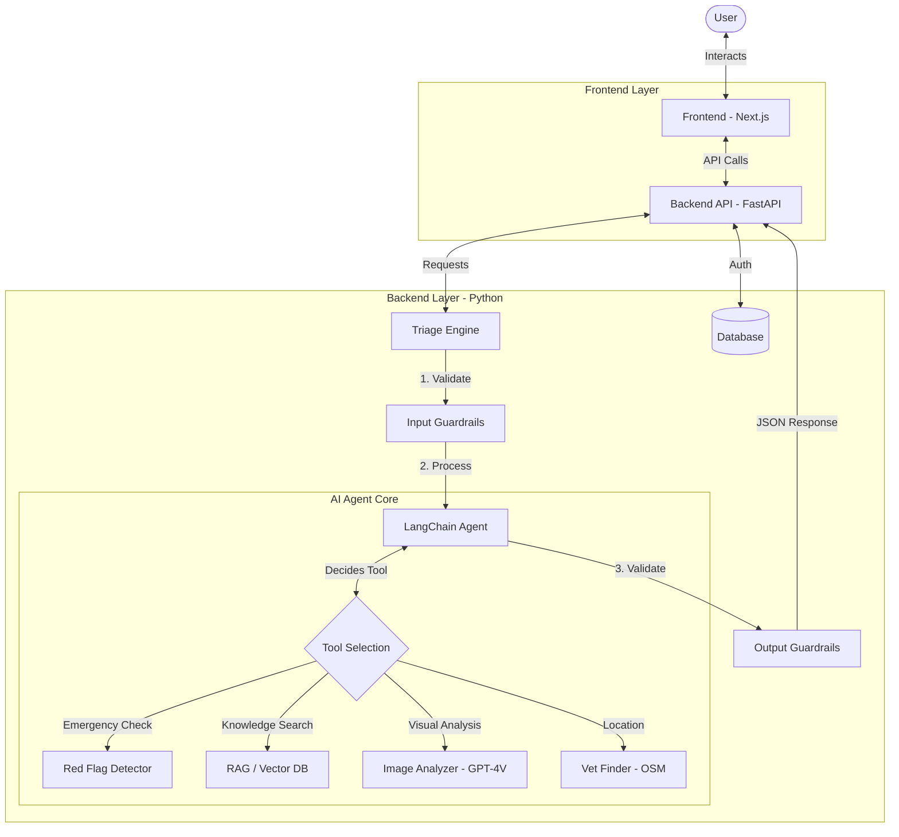

# Fuzzy Friend: AI-Powered Pet Triage System

**Fuzzy Friend** is an intelligent pet health assistant designed to help pet owners assess symptoms, determine urgency, and find nearby veterinary care. It combines a user-friendly Next.js frontend with a robust Python backend powered by LLM Agents and RAG (Retrieval-Augmented Generation).

---

## System Architecture

The system follows a modern client-server architecture with an autonomous AI agent core.



---

## Project Structure

```
genai_group_project/
├── .env                    # Environment variables (API keys)
├── README.md               # This file
├── frontend/               # Next.js frontend application
│   ├── app/                # Page routes
│   ├── components/         # Reusable UI components
│   └── lib/                # Utility functions
└── pet_triage/             # Python backend
    ├── api.py              # FastAPI entry point
    ├── auth.py             # JWT authentication
    ├── database.py         # SQLite database operations
    ├── core/               # AI Agent and RAG
    │   ├── agent.py        # LangChain Agent
    │   ├── tools.py        # Agent tools
    │   ├── rag_chain.py    # RAG knowledge base
    │   └── image_analyzer.py
    ├── shared/             # Shared constants and schemas
    └── tests/              # Unit tests
```

---

## Key Features

1. **AI Triage Assessment**: Structured analysis of symptoms to determine urgency (ER, Today, Soon, Monitor).
2. **Patient Chart Memory**: The AI remembers past triage sessions to identify recurring issues without confusing history with current symptoms.
3. **Multi-turn Chat**: Users can ask follow-up questions in "General Question" mode with full conversation history context.
4. **Visual Symptom Analysis**: Users can upload photos of their pet's condition for GPT-4V analysis.
5. **RAG Knowledge Base**: Answers backed by a vector database of 18,000+ veterinary records.
6. **Nearby Vet Finder**: Automatically locates open clinics based on the user's geolocation.
7. **Safety Guardrails**: Strict input/output validation to prevent hallucinations and ensure safe medical advice.

---

## Getting Started

### Prerequisites
- Node.js and npm
- Python 3.10+
- OpenAI API Key (set in `.env` file)

### Quick Start (One Command)

```bash
# Mac/Linux
./start.sh

# Or run manually:
# Terminal 1: cd pet_triage && uvicorn api:app --port 8000
# Terminal 2: cd frontend && npm run dev
```

Then open http://localhost:3000 in your browser.

### Manual Installation

1. **Backend Setup**:
    ```bash
    cd pet_triage
    pip install -r requirements.txt
    uvicorn api:app --host 0.0.0.0 --port 8000
    ```

2. **Frontend Setup**:
    ```bash
    cd frontend
    npm install
    npm run dev
    ```

3. Access the app at `http://localhost:3000`.


---

## API Endpoints

| Endpoint | Method | Description |
|----------|--------|-------------|
| `/api/health` | GET | Health check |
| `/api/categories` | GET | Get symptom categories |
| `/api/triage` | POST | Run symptom triage (with history) |
| `/api/chat` | POST | General pet health chat (multi-turn) |
| `/api/auth/register` | POST | User registration |
| `/api/auth/login` | POST | User login |
| `/api/pet-profile` | POST | Save pet profile |
| `/api/nearby-vets` | POST | Find nearby clinics |
